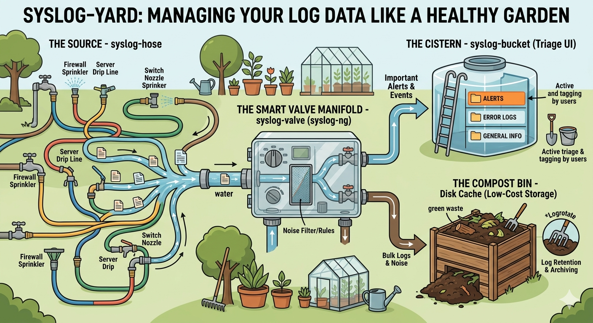

# syslog-yard

syslog-yard is an open-source, self-hosted syslog toolkit. It's three small
tools that run as containers under a single compose file:

- **syslog-hose** generates random but realistic syslog traffic at whatever rate you set.
- **syslog-valve** is a visual router and filter built on syslog-ng: graphical
  IN and OUT ports, filtering in between, TLS, and disk caching with
  logrotate-managed retention.
- **syslog-bucket** is a multi-user syslog server with a triage UI modeled on an email client.



Each tool works on its own. Run all three and you get a full loop (generate,
then route and filter, then store) on one internal bridge network, with web UIs
on ports 8080, 8081, and 8082.

## Mission

The idea behind syslog-yard is simple: make syslog approachable. Generate it,
shape it, and triage it from a browser instead of hand-editing config files and
living in `grep`. It's meant to be something a single engineer can stand up in a
few minutes, whether you want to learn how syslog actually flows, test a pipeline
before it touches production, or trim the noise you'd otherwise pay to store
downstream. There are no agents to license, no per-GB bill, and no SaaS account.
Just three small containers and a browser.

## Why syslog-yard, and how it compares

**It's easy to pick up.** You don't have to memorize a config language. You draw
a flow on a canvas (drag an IN port, a filter, an OUT port, wire them together,
and click Apply), and the valve turns that into a syslog-ng config, runs a syntax
check, swaps it in atomically, and keeps every previous version for one-click
rollback. The bucket looks and works like a 3-pane email inbox, so searching,
tagging, prioritizing, and marking things benign all feel familiar. The hose
makes realistic traffic from vendor presets at a rate you choose, so you can
exercise a whole pipeline without wiring up real devices. One sign-in covers all
three UIs.

**Good for UI-based syslog testing and manipulation.** Say you need to reproduce
a FortiGate burst, a Cisco ASA login storm, or a Claroty OT alert to check a
detection or a forwarding rule. Pick the preset, set the rate, and watch it move
through the valve's live per-wire counters into the bucket, all from the browser.
Change a filter and re-apply in a few seconds, and roll it back if you got it
wrong.

**It can lower what you pay your SOC.** Most SIEMs and log platforms (Splunk,
Datadog, Microsoft Sentinel, Elastic) charge by ingested volume or events per
second, and raw syslog is mostly low-value noise. The valve sits in front of
them as a visual filter and router: forward only the critical and high-severity
events to the expensive tier, drop or branch the rest, and cache the bulk to
cheap local disk or a NAS share with logrotate retention. Cutting noise before it
reaches the billed tier is exactly how you bring a per-GB bill down. It's the
same data-reduction idea that commercial pipelines like Cribl Stream sell, except
here it's an open graph you draw and apply yourself.

Here's roughly how it lines up against the alternatives:

| Instead of... | syslog-yard gives you |
|---|---|
| Hand-editing `syslog-ng.conf` or `rsyslog.conf` and reloading | A visual node graph compiled to syslog-ng, syntax-checked, applied atomically, with one-click rollback |
| A paid routing and reduction pipeline (Cribl Stream, syslog-ng Premium Edition) | The same route, filter, drop, and cache-to-disk, open-source and self-hosted |
| A paid syslog server (for example SolarWinds Kiwi) | A multi-user, email-style triage server with rules, tags, and MITRE ATT&CK / OT mapping |
| `logger` or throwaway scripts to fake traffic | A UI generator with realistic vendor presets (FortiGate, Cisco, Claroty CTD/xDome, and more) at a set rate |
| Paying your SIEM to ingest everything | Filtering and caching noise out before it ever reaches the billed tier |

To be clear about what it isn't: this is not an enterprise SIEM or a managed
service. It's an opinionated, single-compose-file toolkit for labs, training,
pipeline prototyping, and small deployments, where being free, self-hosted, and
quick to learn matters more than scale-out clustering and a support contract.

## Quick start

```sh
scripts/yardctl prereqs    # fresh system: install container runtime
scripts/yardctl up         # build + start the suite
scripts/yardctl firewall   # open ports (firewalld/ufw, needs sudo)
scripts/yardctl status     # health check; also: down / restart / logs / smoke
scripts/yardctl service-install  # optional: start the suite at boot (systemd)
```

The UIs live at hose http://localhost:8080, valve http://localhost:8081, and
bucket http://localhost:8082. Each one has a small **yard** nav that links to the
other two. All three share a single sign-in: accounts are defined in the bucket,
which acts as the yard's identity provider, so signing in at any UI covers the
others. On first start the bucket creates an `admin` account with a random
password that it prints once in its log. Grab it with
`scripts/yardctl logs syslog-bucket | grep -i password`, or set a new one any
time with `scripts/yardctl reset-admin`. For users, roles, OIDC single sign-on,
and bucket sharing, see [docs/AUTH.md](docs/AUTH.md).

To send external syslog in, add an **External IN** block in the valve (toolbar
button — a source on container port 6514, udp+tcp, published as host port
**6514**), wire it, and Apply. Then from another machine:
`logger -n <yard-host> -P 6514 -T -p user.err "hello yard"` (`-T` tcp, `-d` udp).
The block's *enabled* toggle is the "allow external sources" switch: untick and
Apply to shut external intake off without losing the wiring. Internal hose
traffic uses container port 514, so it routes independently. "Connection
refused" usually means the sender targets port 514 on the host (nothing listens
there) or no External IN flow is applied. Devices that can only send to classic
514 are covered too: uncomment the `514:6514` pairs in `deploy/compose.yaml`
(the comment there explains the one-time sysctl rootless podman needs for a
privileged port). One more thing to watch for: VM-based runtimes (Rancher/Docker
Desktop, Colima) forward TCP but not UDP across the VM boundary. `yardctl smoke`
probes both and tells you which one arrived.

## Install on a clean Linux server or WSL (Podman)

Everything builds and runs from source, so there's no registry to pull from.
Rootless Podman is enough: the suite uses ports 8080-8082 and 6514, all above
1024, so nothing needs privileged binding.

You'll need `git`, `podman` (version 4.6 or newer), a compose provider
(`podman-compose`, or `podman compose` with a docker-compose binary), and `curl`
for the health and smoke checks.

```sh
# Fedora / RHEL / CentOS Stream
sudo dnf install -y git podman podman-compose curl

# Debian / Ubuntu (including WSL Ubuntu)
sudo apt update && sudo apt install -y git podman podman-compose curl
```

`scripts/yardctl prereqs` will do that for you on dnf and apt hosts. After that:

```sh
git clone https://github.com/fqazzazee/syslog-yard
cd syslog-yard
scripts/yardctl up         # builds the three images locally with podman, starts the suite
scripts/yardctl firewall   # optional: open 8080-8082 + 6514 (firewalld/ufw, needs sudo)
scripts/yardctl status     # health checks; also: down / restart / logs / smoke
scripts/yardctl service-install  # optional: start the suite at boot (systemd)
```

On WSL, run `wsl --update` first and use a recent Ubuntu or Fedora distro. Like
other VM runtimes, WSL forwards TCP but not UDP across the boundary, so send
external syslog over TCP to host port 6514 (`yardctl smoke` reports which
transport arrived). If you'd rather start the yard at boot as rootless systemd
services without compose, see [deploy/quadlet](deploy/quadlet).

## The demo loop

The hose streams FortiGate traffic at the valve. The valve forwards critical and
high severities to the bucket and rotates the noise to disk. The bucket tags and
sorts whatever arrives.

**syslog-hose**, generator jobs built from vendor presets, with a live tail below:


**syslog-valve**, two IN ports feeding a severity filter where `match` forwards
to the bucket and `else` caches to disk under logrotate retention:


**syslog-bucket**, email-client-style triage of the alerts that got through,
auto-tagged by rules:


## Documentation

| Doc | Covers |
|-----|--------|
| [docs/AUTH.md](docs/AUTH.md) | bucket sign-in, roles, OIDC (with an authentik SSO walkthrough), sharing buckets |
| [docs/MITRE.md](docs/MITRE.md) | ATT&CK mapping, the matrix view, the Claroty OT alert view, sorting, device class, valve technique filter |
| [docs/NOTIFICATIONS.md](docs/NOTIFICATIONS.md) | webhook / Slack-Teams / SMTP channels fired by the notify rule action |
| [docs/SECURITY.md](docs/SECURITY.md) | threat model, what's defended, production hardening checklist |
| [docs/SHARES.md](docs/SHARES.md) | external NAS shares (NFS/CIFS) for log storage |
| [deploy/quadlet](deploy/quadlet) | rootless podman systemd units |
| per-app READMEs | standalone use, env vars, development |

## Continuous integration

There's one GitHub Actions workflow,
[`.github/workflows/test.yaml`](.github/workflows/test.yaml), and it's purely a
correctness gate. It builds and ships nothing.

What it runs: `go test ./...` for each of the three modules (`syslog-hose`,
`syslog-valve`, `syslog-bucket`) as a parallel matrix on a clean Ubuntu runner.
Each leg checks out the repo, installs the Go version pinned in that module's
`go.mod`, and runs its tests. Since `go test` compiles every package first and
runs a subset of `go vet`, a build break or a broken embed will fail the run too,
not just a failing assertion.

When it runs: on every push to `main`, on every pull request, and on demand (the
Run workflow button in the Actions tab). `fail-fast` is off, so you see all three
results even if one of them fails.

What it deliberately doesn't do: it builds no container images, pushes nothing to
any registry (no GHCR), and deploys nothing. The suite is always built locally
from source (`scripts/yardctl up`, or `podman build`). The workflow just tells
you whether the code is still green on a machine with none of your local state,
which is the kind of thing that catches "works on my machine" regressions.

To run the same checks locally:

```sh
cd apps/syslog-bucket && go test ./...   # repeat for syslog-hose / syslog-valve
```

## Features by tool

- **syslog-hose**: vendor presets (FortiGate, Cisco, Linux, OT switches, Claroty
  CTD and xDome OT/ICS CEF alerts, and more), rate control, multiple concurrent
  jobs, and a live tail of what it sends.
- **syslog-valve**: a node-graph canvas compiled to syslog-ng config with a
  syntax check, atomic swap, and one-click rollback; UDP/TCP/TLS listeners (with
  one-click self-signed certs); facility, severity, host, program, regex, and
  MITRE ATT&CK technique filters with if/else routing; disk cache nodes whose
  retention compiles to logrotate; in-stream notify nodes (webhook, Slack/Teams)
  that alert on the raw flow before storage; a live tail of everything entering
  the valve; live per-wire throughput on the canvas (msgs/sec from
  `syslog-ng-ctl stats`); config version history with previews; and graph
  import/export.
- **syslog-bucket**: syslog-ng-fronted ingest into Postgres; email-style 3-pane
  triage; virtual buckets (saved searches), color-coded tags, and a rules engine
  that tags, prioritizes, suppresses, and classifies at ingest and
  retroactively; MITRE ATT&CK mapping at ingest with a kill-chain matrix view, a
  parallel Claroty-style OT alert view (Security and Integrity alert types), and
  compliance-framework views (NIST CSF, CIS v8, IEC 62443, the Cyber Kill Chain,
  NIST 800-53, and a data-sensitivity view) crosswalked from the ATT&CK and OT
  mappings and the device class, plus custom org-defined frameworks you create in
  the UI; every mapping shows an "unclassified" coverage gap; analyst
  classification with a `benign` triage outcome, hand-adding or removing ATT&CK
  and OT codes on entries the packs missed, and a "Create rule from this entry"
  shortcut that promotes a manual call into a reusable detection (the
  `set_mitre` and `set_ot` rule actions); curated default buckets for a SOC
  triage workload; rules that condition and tag on MITRE techniques; device-class
  tagging and sortable, filterable columns; notifications (webhook, Slack/Teams,
  SMTP) fired by a notify rule action; a live tail over WebSocket; local accounts
  plus OIDC sign-in with admin/analyst/viewer roles; and buckets shareable
  per-user, view-only or editable.

## Status

The suite works end to end (generate, route and filter, store) and is usable for
a real lab or a small deployment today. What's in place:

- Single sign-on across all three UIs with local and OIDC accounts and
  admin/analyst/viewer roles. The bucket is the yard's identity provider
  ([docs/AUTH.md](docs/AUTH.md)).
- A reviewed security posture: parameterized queries everywhere, CSP and
  hardening headers, login throttling, and a documented threat model
  ([docs/SECURITY.md](docs/SECURITY.md)).
- MITRE ATT&CK mapping with a kill-chain matrix, a Claroty-style OT alert view,
  sorting and filtering, and device classification ([docs/MITRE.md](docs/MITRE.md)).
- Compliance-framework views (NIST CSF, CIS Controls v8, IEC 62443, the Cyber
  Kill Chain, NIST 800-53, and a data-sensitivity matrix) crosswalked from the
  ATT&CK and OT mappings and the device class, plus custom org frameworks you
  define in the UI. Each view shows an "unclassified" coverage gap. Rules can
  condition (and tag or classify) on a MITRE technique, and the curated default
  buckets reflect a SOC triage workload.
- Analyst classification: a `benign` triage outcome, hand-adding ATT&CK and OT
  codes to entries the automated packs missed, and "Create rule from this entry"
  to turn that manual call into a reusable detection.
- Notifications to webhook, Slack/Teams, and SMTP, from the bucket and in-stream
  on the valve ([docs/NOTIFICATIONS.md](docs/NOTIFICATIONS.md)).
- A unified, icon-driven UI across the three tools, with a built-in About/Help
  panel (the `?` button) and a dark/light theme toggle (remembered per browser)
  in every top bar.
- Admin-configurable OIDC single sign-on and session idle-timeout, set from the
  bucket's Settings panel and applied without a restart ([docs/AUTH.md](docs/AUTH.md)).

A few things are still on the radar:

- More crosswalk depth (sub-techniques, NIST 800-53 control enhancements) and a
  one-click export of a framework's coverage as a report.
- Per-wire byte throughput and queue depth on the valve, alongside the msgs/sec
  rate, plus a small sparkline history per wire.

## A note on AI assistance

Parts of this codebase were written and tested with the help of large language
models. The design choices, review, and final call are human, and everything
here is built and tested before it lands, but it's only fair to say that LLM
tooling was part of how it was made.

## License

syslog-yard is free and open source under the MIT License. You're welcome to run
it, modify it, and use it for personal or commercial purposes at no cost. It
comes as-is, with no warranty of any kind, so use it at your own risk. See the
[LICENSE](LICENSE) file for the full terms.
