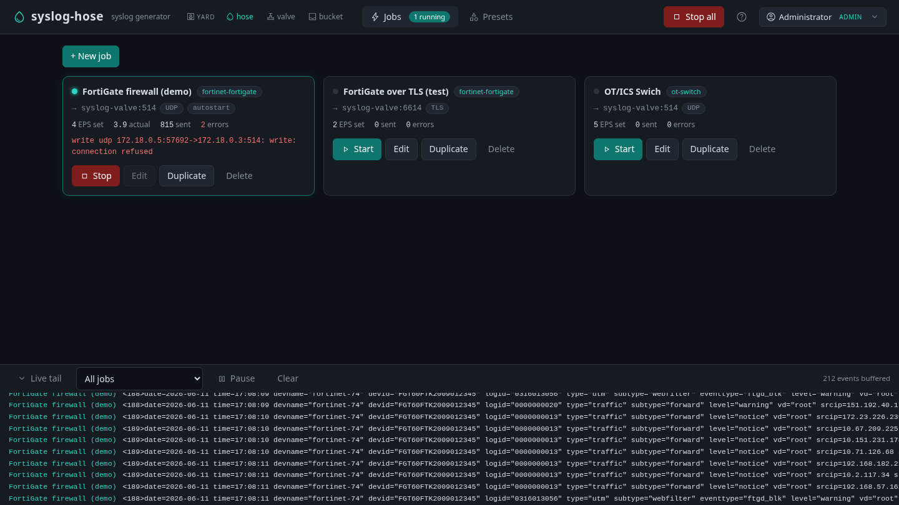
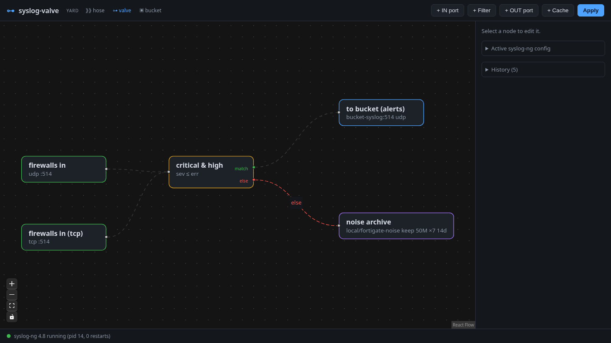
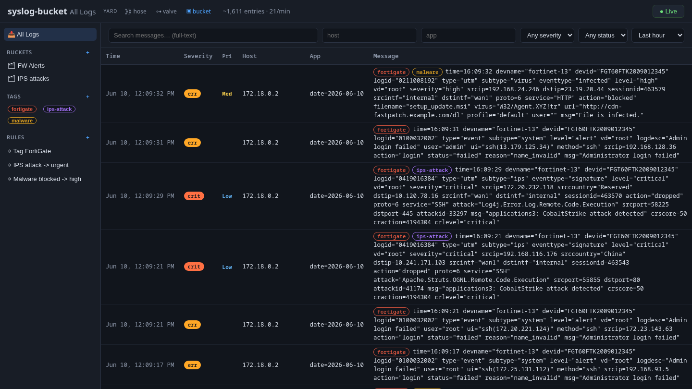

# syslog-yard

One yard, three tools — an open-source, self-hosted syslog toolkit, deployed as
simple containers under a single compose file:

- **syslog-hose** — generates random-but-realistic syslog traffic at a configurable rate
- **syslog-valve** — visual router/filter built on syslog-ng: graphical IN/OUT ports,
  filtering in between, TLS, disk caching with logrotate-managed retention
- **syslog-bucket** — multi-user syslog server and triage UI modeled on an email client

Each tool runs standalone; together they form a complete loop —
generate → route/filter → store — on one internal bridge network, with UIs on
ports 8080 / 8081 / 8082.

## Quick start

```sh
scripts/yardctl prereqs    # fresh system: install container runtime
scripts/yardctl up         # build + start the suite
scripts/yardctl firewall   # open ports (firewalld/ufw, needs sudo)
scripts/yardctl status     # health check; also: down / restart / logs / smoke
```

UIs: hose http://localhost:8080 · valve http://localhost:8081 · bucket
http://localhost:8082 — each UI carries a small **yard** nav linking to the
other two. All three UIs share one sign-in: accounts are defined in the
bucket (the yard's identity provider), and signing in at any UI covers the
others. On first start the bucket creates an `admin` account with a
**random password printed once in its log** — grab it with
`scripts/yardctl logs syslog-bucket | grep -i password`, or set a fresh
one anytime with `scripts/yardctl reset-admin`. See
[docs/AUTH.md](docs/AUTH.md) for users, roles, OIDC single sign-on, and
bucket sharing.

External syslog entry: host port **6514** (udp/tcp) into the valve's IN
ports. Note: VM-based runtimes (Rancher/Docker Desktop, Colima) forward TCP
but not UDP across the VM boundary — `yardctl smoke` probes both and tells
you which arrived.

## Install on a clean Linux server or WSL (Podman)

Everything builds and runs **from source** — there is no registry to pull from.
Rootless Podman is enough: the suite uses ports 8080–8082 and 6514, all above
1024, so no privileged binding is needed.

**Prerequisites:** `git`, `podman` (≥ 4.6), a compose provider
(`podman-compose`, or `podman compose` with a docker-compose binary), and
`curl` (for the health/smoke checks).

```sh
# Fedora / RHEL / CentOS Stream
sudo dnf install -y git podman podman-compose curl

# Debian / Ubuntu (including WSL Ubuntu)
sudo apt update && sudo apt install -y git podman podman-compose curl
```

`scripts/yardctl prereqs` will do this for you on dnf/apt hosts. Then:

```sh
git clone https://github.com/fqazzazee/syslog-yard
cd syslog-yard
scripts/yardctl up         # builds the three images locally with podman, starts the suite
scripts/yardctl firewall   # optional: open 8080-8082 + 6514 (firewalld/ufw, needs sudo)
scripts/yardctl status     # health checks — also: down / restart / logs / smoke
```

**WSL notes:** run `wsl --update` first and use a recent Ubuntu/Fedora distro.
Like other VM runtimes, WSL forwards TCP but not UDP across the boundary — send
external syslog over **TCP** to host port 6514 (`yardctl smoke` reports which
transport arrived). To start the yard at boot as rootless systemd services
(no compose), see [deploy/quadlet](deploy/quadlet).

## The demo loop

The hose streams FortiGate traffic at the valve; the valve forwards
critical/high severities to the bucket and rotates the noise to disk;
the bucket tags and sorts what arrives.

**syslog-hose** — generator jobs built from vendor presets, live tail below:



**syslog-valve** — two IN ports feed a severity filter; `match` forwards to
the bucket, `else` caches to disk under logrotate retention:



**syslog-bucket** — email-client-style triage of the alerts that got
through, auto-tagged by rules:



## Documentation

| Doc | Covers |
|-----|--------|
| [docs/AUTH.md](docs/AUTH.md) | bucket sign-in, roles, OIDC, sharing buckets |
| [docs/MITRE.md](docs/MITRE.md) | ATT&CK mapping, the matrix view, the Claroty OT alert view, sorting, device class, valve technique filter |
| [docs/NOTIFICATIONS.md](docs/NOTIFICATIONS.md) | webhook / Slack-Teams / SMTP channels fired by the notify rule action |
| [docs/SECURITY.md](docs/SECURITY.md) | threat model, what's defended, production hardening checklist |
| [docs/SHARES.md](docs/SHARES.md) | external NAS shares (NFS/CIFS) for log storage |
| [deploy/quadlet](deploy/quadlet) | rootless podman systemd units |
| per-app READMEs | standalone use, env vars, development |

## Continuous integration

One GitHub Actions workflow, [`.github/workflows/test.yaml`](.github/workflows/test.yaml),
acts purely as a **correctness gate** — it builds and ships nothing.

**What it runs:** `go test ./...` for each of the three modules
(`syslog-hose`, `syslog-valve`, `syslog-bucket`) as a parallel matrix on a
clean Ubuntu runner. Each leg checks out the repo, installs the Go version
pinned in that module's `go.mod`, and runs its tests. Because `go test`
compiles every package first and runs a subset of `go vet`, a build break or
a broken embed fails the run too — not just a failing assertion.

**When it runs:** on every **push to `main`**, on every **pull request**, and
on demand (*Run workflow* in the Actions tab). `fail-fast` is off, so all
three results show even if one fails.

**What it deliberately does not do:** no container images are built, nothing
is pushed to any registry (no GHCR), and nothing is deployed. The suite is
always built locally from source (`scripts/yardctl up`, or `podman build`);
this workflow only tells you whether the code is still green on a machine with
none of your local state — the kind of check that catches "works on my
machine" regressions.

**Run the same checks locally:**

```sh
cd apps/syslog-bucket && go test ./...   # repeat for syslog-hose / syslog-valve
```

## Features by tool

- **syslog-hose**: vendor presets (FortiGate, Cisco, Linux, OT switches,
  **Claroty CTD & xDome** OT/ICS CEF alerts, …), rate control, multiple
  concurrent jobs, live tail of what it sends.
- **syslog-valve**: node-graph canvas compiled to syslog-ng config with
  syntax check, atomic swap, and one-click rollback; UDP/TCP/TLS listeners
  (one-click self-signed certs); facility/severity/host/program/regex and
  **MITRE ATT&CK technique** filters with if/else routing; disk cache nodes
  with retention compiled to logrotate; **in-stream notify nodes** (webhook,
  Slack/Teams) that alert on the raw flow before storage; live tail of
  everything entering the valve; config version history with previews; graph
  import/export.
- **syslog-bucket**: syslog-ng-fronted ingest into Postgres; email-style
  3-pane triage; virtual buckets (saved searches), color-coded tags, a rules
  engine that tags/prioritizes/suppresses/classifies at ingest and
  retroactively; **MITRE ATT&CK mapping at ingest with a kill-chain matrix
  view**, a parallel **Claroty-style OT alert view** (Security / Integrity
  alert types), and **compliance-framework views** — NIST CSF, CIS v8,
  IEC 62443, the **Cyber Kill Chain**, **NIST 800-53**, and a
  **data-sensitivity** view — crosswalked from the ATT&CK/OT mappings (and the
  device class), plus **custom org-defined frameworks** you create in the UI;
  every mapping shows an **"unclassified" coverage gap**; **analyst
  classification** — a `benign` triage outcome, hand-adding/removing ATT&CK and
  OT codes on entries the packs missed, and **"Create rule from this entry"**
  to promote a manual call into a reusable detection (`set_mitre`/`set_ot`
  rule actions); curated default buckets for a SOC triage workload; rules that
  condition/tag on MITRE techniques; device-class tagging and
  sortable/filterable columns; **notifications** (webhook, Slack/Teams, SMTP)
  fired by a notify rule action; live tail over WebSocket; local accounts +
  OIDC sign-in with admin/analyst/viewer roles; buckets shareable per-user,
  view-only or editable.

## Status

The suite works end-to-end — generate → route/filter → store — and is usable for
a real lab or small deployment today. What's in place:

- Single sign-on across all three UIs with local + OIDC accounts and
  admin/analyst/viewer roles; the bucket is the yard's identity provider
  ([docs/AUTH.md](docs/AUTH.md)).
- A reviewed security posture — parameterized everywhere, CSP + hardening
  headers, login throttling, and a documented threat model
  ([docs/SECURITY.md](docs/SECURITY.md)).
- MITRE ATT&CK mapping with a kill-chain matrix, a Claroty-style OT alert view,
  sorting/filtering, and device classification ([docs/MITRE.md](docs/MITRE.md)).
- **Compliance-framework views** — NIST CSF, CIS Controls v8, IEC 62443, the
  Cyber Kill Chain, NIST 800-53 and a data-sensitivity matrix, crosswalked from
  the ATT&CK / OT mappings (and device class), plus custom org frameworks you
  define in the UI; each view shows an "unclassified" coverage gap. Rules can
  condition (and tag/classify) on a MITRE technique; curated default buckets
  reflect a SOC triage workload.
- **Analyst classification** — a `benign` triage outcome, hand-adding ATT&CK and
  OT codes to entries the automated packs missed, and "Create rule from this
  entry" to promote that manual call into a reusable detection.
- Notifications to webhook / Slack-Teams / SMTP, from the bucket and in-stream
  on the valve ([docs/NOTIFICATIONS.md](docs/NOTIFICATIONS.md)).
- A unified, icon-driven UI across the three tools with a built-in About/Help
  panel (the `?` button) in every top bar.

Possible improvements on the radar:

- Per-edge throughput rendered on the valve's wires from `syslog-ng-ctl stats`.
- More crosswalk depth (sub-techniques, NIST 800-53 control enhancements) and a
  one-click export of a framework's coverage as a report.
